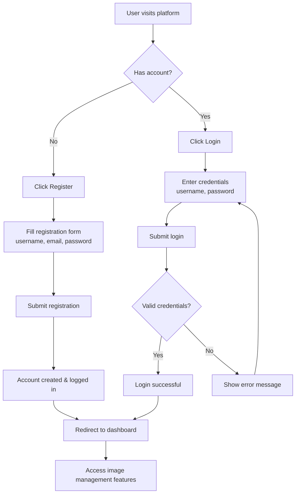
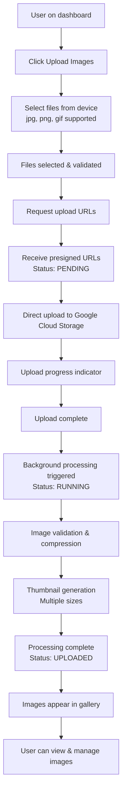
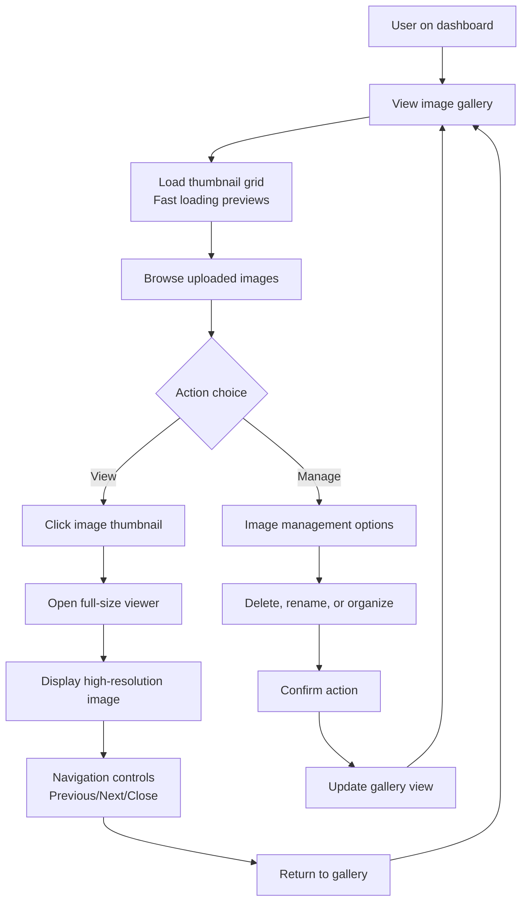
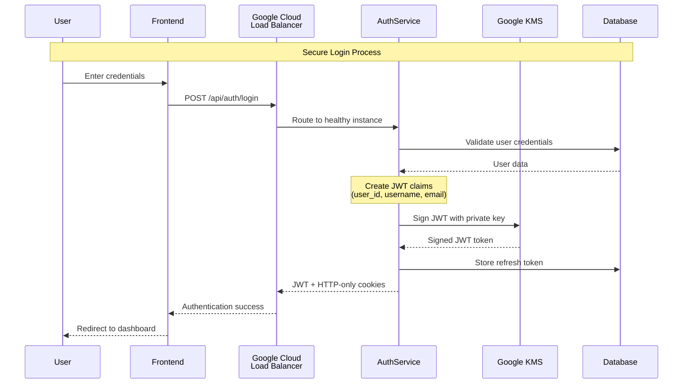
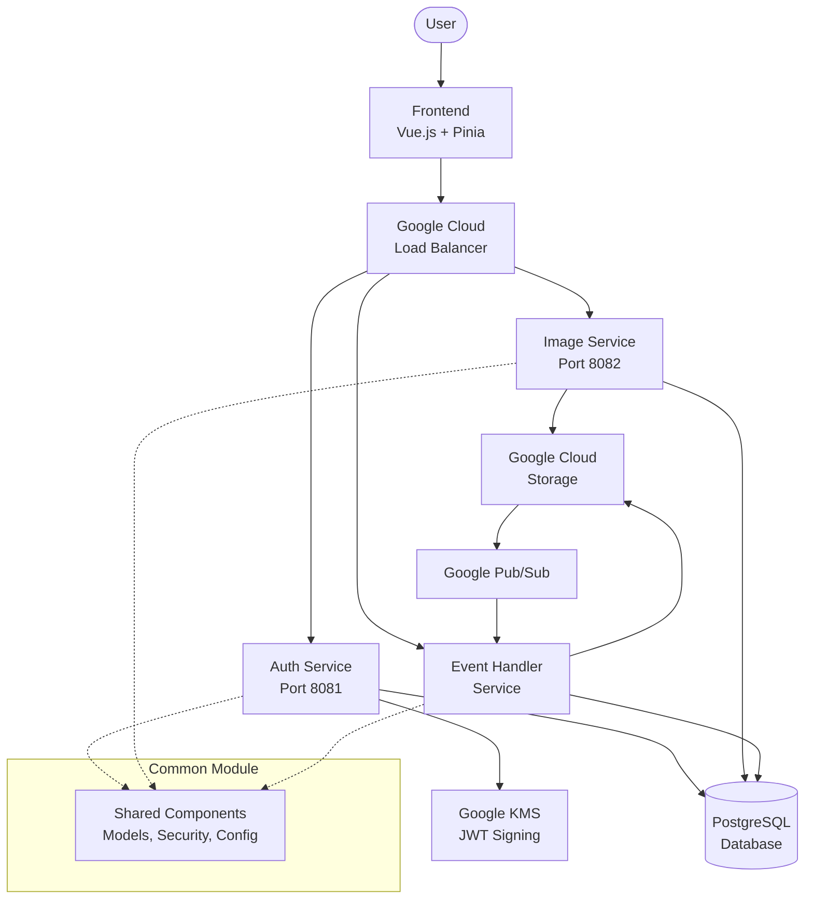

# CDC Image Platform

A modern, cloud-native image processing platform built with microservices architecture, featuring secure JWT authentication, event-driven processing, and scalable image management.

## 🏗️ Architecture Overview

The CDC Image Platform is built using a microservices architecture with the following components:

- **Frontend**: Vue.js 3 with Pinia state management
- **Auth Service**: JWT authentication with Google KMS integration
- **Image Service**: Image upload and metadata management
- **Image Event Handler**: Asynchronous image processing
- **Common Module**: Shared components and utilities

## 🚀 Key Features

- ✅ **Secure Authentication** - JWT tokens signed with Google KMS
- ✅ **Direct Upload** - Presigned URLs for efficient file uploads
- ✅ **Event-Driven Processing** - Asynchronous image compression and thumbnail generation
- ✅ **Load Balanced** - Google Cloud Load Balancer for high availability
- ✅ **Scalable Storage** - Google Cloud Storage integration
- ✅ **Responsive Design** - Multiple thumbnail sizes for different devices
- ✅ **Status Tracking** - Real-time processing status updates

## 🎯 User Journeys

### 1. User Registration & Login Journey



**Journey Steps:**
1. **Landing** - User arrives at the platform
2. **Authentication Choice** - Register new account or login
3. **Credential Entry** - Secure form submission
4. **JWT Generation** - Backend creates signed JWT tokens
5. **Dashboard Access** - User gains access to image features

### 2. Image Upload Journey



**Journey Steps:**
1. **Initiation** - User decides to upload images
2. **File Selection** - Choose images from device
3. **URL Generation** - Backend creates secure upload URLs
4. **Direct Upload** - Files go directly to cloud storage
5. **Processing** - Automatic compression and thumbnail generation
6. **Completion** - Images ready for viewing and management

### 3. Image Viewing Journey



**Journey Steps:**
1. **Gallery Access** - User navigates to image collection
2. **Thumbnail Browsing** - Quick preview of all images
3. **Image Selection** - Choose image for viewing or management
4. **Full-Size Display** - High-resolution image viewer
5. **Management Actions** - Delete, organize, or modify images

## 🔐 Authentication Flow

### JWT Authentication with Google KMS

Our authentication system uses enterprise-grade security with Google KMS for JWT token signing:



### Key Authentication Features

- **🔐 Google KMS Integration** - Enterprise-grade key management for JWT signing
- **⚡ Public Key Caching** - Microservices cache public keys for fast validation
- **🔄 Automatic Token Refresh** - Seamless renewal 60 seconds before expiry
- **🛡️ HTTP-Only Cookies** - Secure token storage preventing XSS attacks
- **📈 Distributed Validation** - Each microservice validates JWTs independently
- **🎯 Stateless Design** - No server-side session storage required

### Token Lifecycle

1. **Login** → KMS signs JWT → Services cache public key
2. **API Requests** → Services validate using cached public key
3. **Auto Refresh** → Frontend proactively refreshes before expiry
4. **Logout** → Tokens invalidated and removed

## 🛠️ Technology Stack

### Backend Services
- **Framework**: Spring Boot 3.5.6 with Java 21
- **Architecture**: Reactive microservices with Spring WebFlux
- **Security**: Spring Security with JWT authentication
- **Database**: PostgreSQL with MyBatis ORM
- **Migration**: Flyway for database versioning

### Frontend
- **Framework**: Vue.js 3.5.21 with Vite
- **State Management**: Pinia 3.0.3
- **Routing**: Vue Router 4.5.1
- **HTTP Client**: Axios 1.12.2

### Google Cloud Platform
- **Storage**: Google Cloud Storage for image files
- **Messaging**: Google Pub/Sub for event-driven processing
- **Security**: Google KMS for JWT key management
- **Load Balancing**: Google Cloud Load Balancer
- **Deployment**: Google Artifact Registry

## 📊 System Architecture



## 🗄️ Database Schema

The platform uses a well-designed PostgreSQL schema with the following key tables:

- **`user`** - User accounts and authentication data
- **`refresh_token`** - JWT refresh token management
- **`user_image`** - User's image upload requests and status
- **`uploaded_image`** - Processed image metadata and storage info
- **`generated_image`** - Thumbnail and compressed image variants
- **`processing_job_configuration`** - Image processing rules and settings

### Image Status Flow
```
PENDING → RUNNING → UPLOADED
    ↓         ↓
  EXPIRED   INVALID
```

## 🚀 Getting Started

### Prerequisites
- Java 21+
- Node.js 18+
- PostgreSQL 13+
- Google Cloud Platform account
- Maven 3.8+

### Environment Setup

1. **Clone the repository**
```bash
git clone <repository-url>
cd cdc_image/app
```

2. **Configure environment variables**
```bash
# Database Configuration
export CDC_IMAGE_DB_URL="jdbc:postgresql://localhost:5432/cdc_image"
export CDC_IMAGE_DB_USER="your_db_user"
export CDC_IMAGE_DB_PASSWORD="your_db_password"

# Google Cloud Configuration
export JWT_GCP_KMS_PROJECT_ID="your-gcp-project"
export JWT_GCP_KMS_LOCATION="your-kms-location"
export JWT_GCP_KMS_KEYRING="your-keyring"
export JWT_GCP_KMS_KEY="your-key"
export JWT_GCP_KMS_KEY_VERSION="1"

# JWT Configuration
export JWT_ACCESS_TOKEN_EXPIRATION_MIN="15"
export JWT_REFRESH_TOKEN_EXPIRATION_MIN="10080"

# Storage Configuration
export GCP_STORAGE_BUCKET_NAME="your-storage-bucket"
export GCP_STORAGE_PRESIGNED_URL_DURATION_MINUTE="60"
```

3. **Build and run backend services**
```bash
# Build all modules
mvn clean install

# Run Auth Service
cd auth-service
mvn spring-boot:run

# Run Image Service (in new terminal)
cd image-service
mvn spring-boot:run

# Run Image Event Handler (in new terminal)
cd image-event-handler
mvn spring-boot:run
```

4. **Run frontend**
```bash
cd fe
npm install
npm run dev
```

### API Endpoints

#### Authentication
- `POST /api/auth/register` - User registration
- `POST /api/auth/login` - User login
- `POST /api/auth/refresh` - Token refresh
- `POST /api/auth/logout` - User logout

#### Image Management
- `POST /api/image/upload` - Request upload URLs
- `GET /api/image/list` - List user images
- `GET /api/image/{id}/thumbnail` - Get image thumbnail

## 📈 Performance & Scalability

- **Direct Upload**: Files upload directly to Google Cloud Storage, eliminating server bottlenecks
- **Event-Driven Processing**: Asynchronous image processing via Pub/Sub for high throughput
- **Load Balancing**: Multiple service instances behind Google Cloud Load Balancer
- **Caching**: Public key caching reduces KMS API calls
- **Reactive Programming**: Non-blocking I/O with Spring WebFlux

## 🔒 Security Features

- **JWT Authentication**: Tokens signed with Google KMS private keys
- **Public Key Validation**: Distributed validation with cached public keys
- **Automatic Token Refresh**: Prevents session interruptions
- **Presigned URLs**: Secure, time-limited access to storage
- **SSL/TLS**: Encrypted database connections with client certificates
- **HTTP-Only Cookies**: XSS protection for token storage

## 📋 Development Guidelines

- **Code Style**: Follow Spring Boot and Vue.js best practices
- **Testing**: Add unit and integration tests for new features
- **Documentation**: Update API documentation for endpoint changes
- **Security**: All endpoints require JWT authentication except auth endpoints
- **Error Handling**: Use proper HTTP status codes and error messages

## 🤝 Contributing

1. Fork the repository
2. Create a feature branch (`git checkout -b feature/amazing-feature`)
3. Commit your changes (`git commit -m 'Add amazing feature'`)
4. Push to the branch (`git push origin feature/amazing-feature`)
5. Open a Pull Request

## 📄 License

This project is licensed under the MIT License - see the LICENSE file for details.

## 📞 Support

For support and questions:
- Create an issue in the repository
- Contact the development team
- Check the documentation in the `/diagrams` folder for system architecture details
