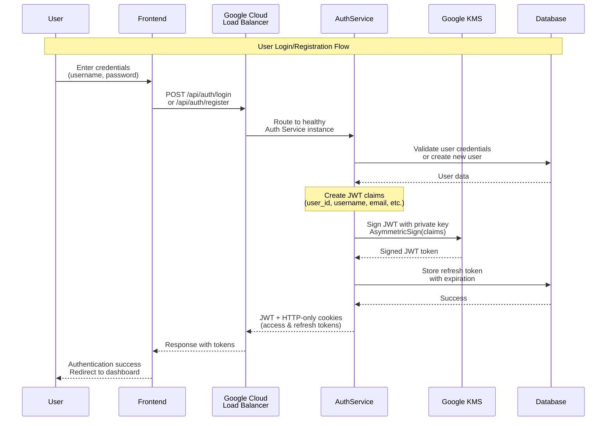
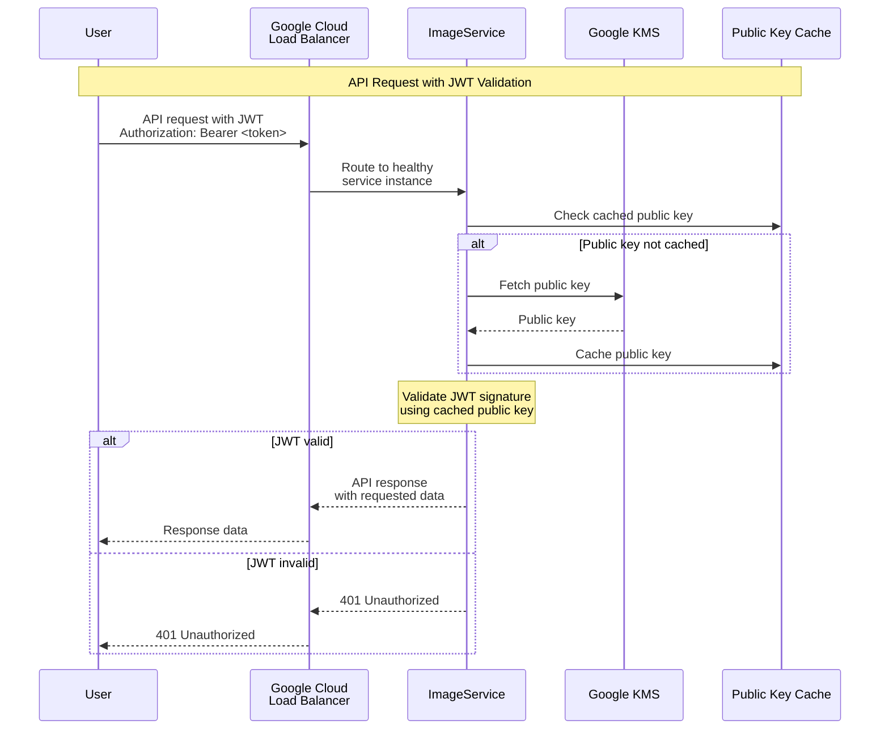
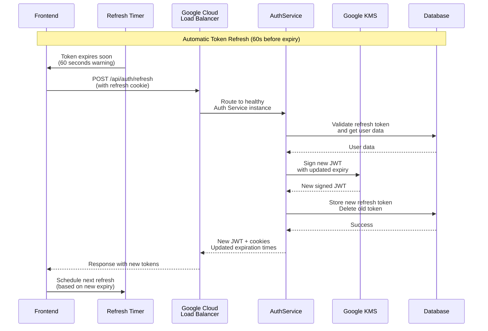
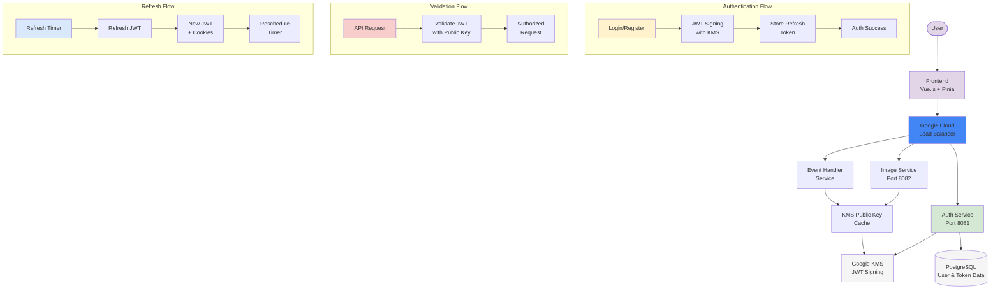
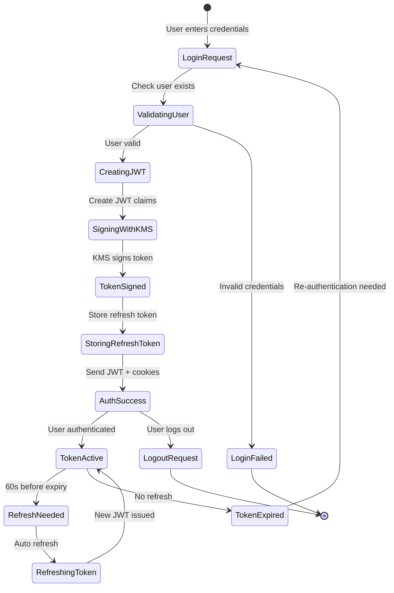
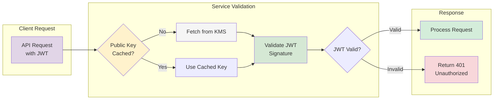

# Authentication Flow - Mermaid Diagrams

## 1. Login/Registration Flow with KMS Integration

## 2. JWT Validation Flow (Microservices)

## 3. Automatic Token Refresh Flow

## 4. Complete Authentication Architecture

## 5. JWT Token Lifecycle

## 6. Microservice JWT Validation Pattern

## Key Benefits of This Authentication Flow

- 🔐 **Centralized Key Management**: Google KMS handles all cryptographic operations
- ⚡ **Performance Optimized**: Public key caching reduces KMS API calls
- 🔄 **Seamless UX**: Automatic token refresh prevents login interruptions
- 🛡️ **Security First**: JWT tokens signed with enterprise-grade KMS
- 📈 **Scalable**: Each microservice validates independently
- 🎯 **Stateless**: No server-side session storage required
- ⚖️ **Load Balanced**: Google Cloud Load Balancer ensures high availability and distributes traffic
- 🚀 **High Availability**: Multiple service instances behind load balancer for fault tolerance

## How to Use

1. Copy any Mermaid code block above
2. Paste into:
   - GitHub/GitLab markdown files
   - [Mermaid Live Editor](https://mermaid.live)
   - Documentation tools (Notion, Obsidian, etc.)
   - VS Code with Mermaid extension
3. The diagrams will render automatically
4. Export to PNG/SVG if needed for presentations
