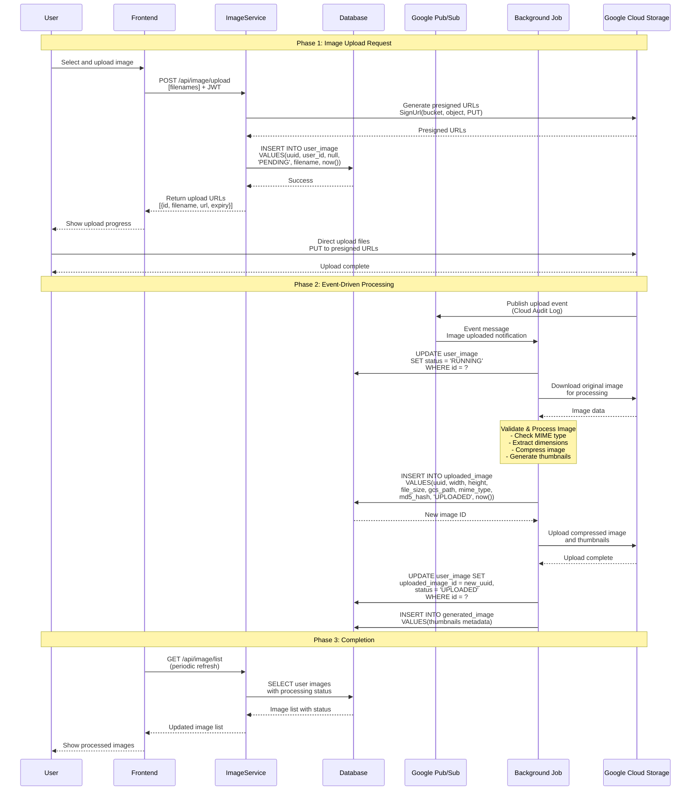
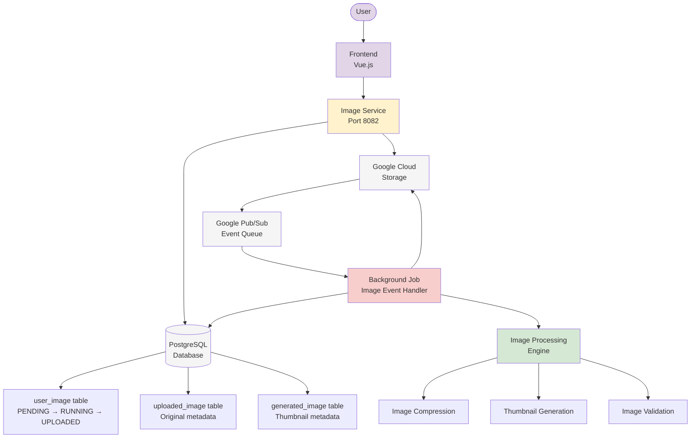
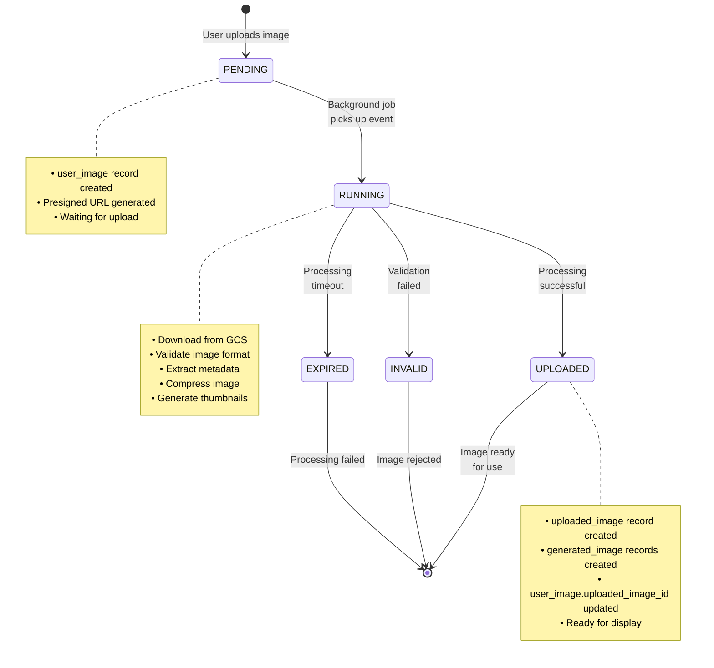
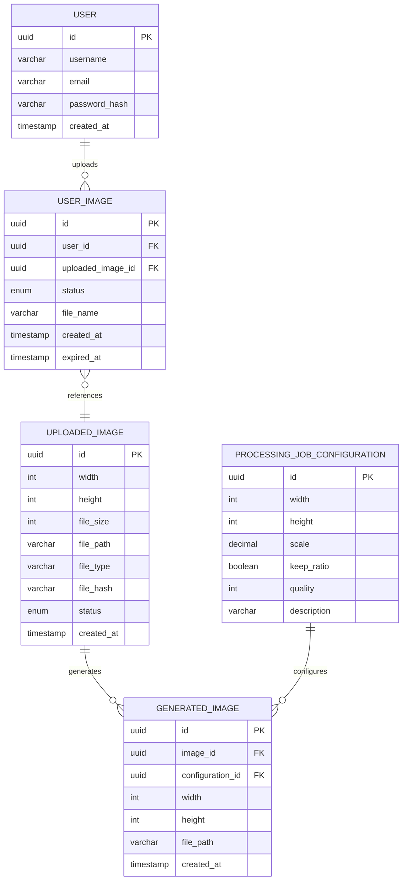
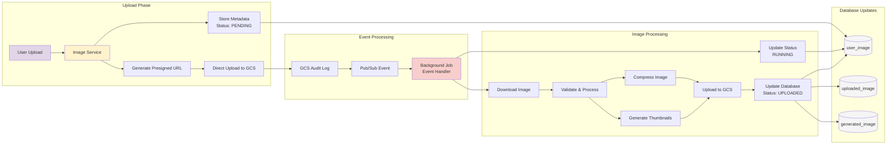
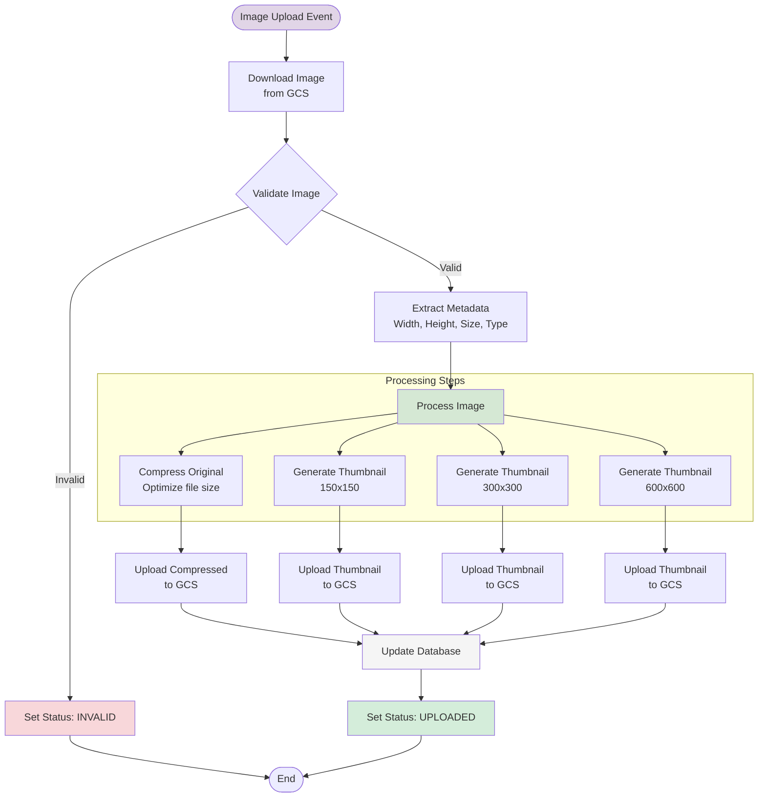

# CDC Image Platform - Mermaid Diagrams

## 1. Image Upload and Processing Flow (Sequence Diagram)

## 2. System Architecture Flow (Flowchart)

## 3. Image Processing State Diagram

## 4. Database Entity Relationship (Simplified)

## 5. Event-Driven Architecture Flow

## 6. Detailed Processing Pipeline

## How to Use These Diagrams

1. **Copy the Mermaid code** from any section above
2. **Paste into any Mermaid-compatible tool**:
   - GitHub/GitLab (in README.md files)
   - Mermaid Live Editor: https://mermaid.live
   - VS Code with Mermaid extension
   - Notion, Obsidian, or other documentation tools
3. **Customize as needed** by modifying the code
4. **Export** to PNG, SVG, or PDF formats

## Key Benefits of This Flow

- ✅ **Asynchronous Processing**: Non-blocking user experience
- ✅ **Event-Driven**: Scalable and decoupled architecture  
- ✅ **Direct Upload**: Eliminates server bottlenecks
- ✅ **Status Tracking**: Complete visibility into processing state
- ✅ **Error Handling**: Graceful failure modes with status updates
- ✅ **Thumbnail Generation**: Automatic optimization for different use cases

