# Image Upload and Viewing Flows - Mermaid Diagrams

## 1. Image Upload Flow (Complete Process)

```mermaid
sequenceDiagram
    participant User
    participant Frontend
    participant LoadBalancer as Google Cloud<br/>Load Balancer
    participant ImageService
    participant GCS as Google Cloud<br/>Storage
    participant Database
    participant PubSub as Google Pub/Sub
    participant BackgroundJob as Background Job<br/>(Event Handler)

    Note over User, BackgroundJob: Phase 1: Upload Request
    User->>Frontend: Select images<br/>["img1.jpg", "img2.png"]
    Frontend->>LoadBalancer: POST /api/image/upload<br/>[filenames] + JWT
    LoadBalancer->>ImageService: Route to healthy<br/>Image Service instance
    
    ImageService->>GCS: Generate presigned URLs<br/>SignUrl(bucket, object, PUT)
    GCS-->>ImageService: Presigned URLs with expiry
    
    ImageService->>Database: Store image metadata<br/>status = 'PENDING'
    Database-->>ImageService: Success
    
    ImageService-->>LoadBalancer: Upload URLs response<br/>[{id, filename, url, expiry}]
    LoadBalancer-->>Frontend: Response with URLs
    Frontend-->>User: Show upload interface

    Note over User, BackgroundJob: Phase 2: Direct Upload
    User->>GCS: Direct upload files<br/>PUT to presigned URLs
    GCS-->>User: Upload complete confirmation

    Note over User, BackgroundJob: Phase 3: Event-Driven Processing
    GCS->>PubSub: Publish upload event<br/>(Cloud Audit Log)
    PubSub->>BackgroundJob: Event message<br/>Image uploaded notification
    
    BackgroundJob->>Database: Update status = 'RUNNING'
    BackgroundJob->>GCS: Download original image
    GCS-->>BackgroundJob: Image data
    
    Note over BackgroundJob: Process Image<br/>• Validate format<br/>• Extract metadata<br/>• Compress image<br/>• Generate thumbnails
    
    BackgroundJob->>GCS: Upload processed images<br/>and thumbnails
    GCS-->>BackgroundJob: Upload complete
    
    BackgroundJob->>Database: Store processed metadata<br/>status = 'UPLOADED'
    Database-->>BackgroundJob: Success

    Note over User, BackgroundJob: Phase 4: Completion Notification
    Frontend->>LoadBalancer: GET /api/image/list<br/>(periodic check)
    LoadBalancer->>ImageService: Route request
    ImageService->>Database: Query user images<br/>with current status
    Database-->>ImageService: Updated image list
    ImageService-->>LoadBalancer: Image list response
    LoadBalancer-->>Frontend: Response data
    Frontend-->>User: Show processed images
```

## 2. Image Viewing Flow

## 3. Image Upload Architecture Flow

## 4. Image Processing State Flow

## 5. Image Viewing Architecture

## 6. Complete Image Lifecycle

## Key Benefits of This Image Flow

- 🚀 **High Performance**: Direct upload to GCS eliminates server bottlenecks
- ⚖️ **Load Balanced**: Multiple service instances handle requests efficiently
- 🔄 **Asynchronous Processing**: Non-blocking user experience during image processing
- 📱 **Responsive**: Automatic thumbnail generation for different screen sizes
- 🛡️ **Secure**: Presigned URLs with expiration for controlled access
- 📊 **Status Tracking**: Complete visibility into processing pipeline
- 🎯 **Scalable**: Event-driven architecture handles high volume
- 💾 **Optimized Storage**: Compressed images and multiple thumbnail sizes

## How to Use

1. Copy any Mermaid code block above
2. Paste into:
   - GitHub/GitLab markdown files
   - [Mermaid Live Editor](https://mermaid.live)
   - Documentation tools (Notion, Obsidian, etc.)
   - VS Code with Mermaid extension
3. The diagrams will render automatically
4. Export to PNG/SVG if needed for presentations
